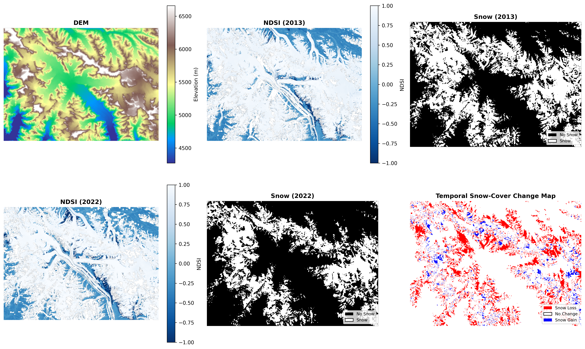
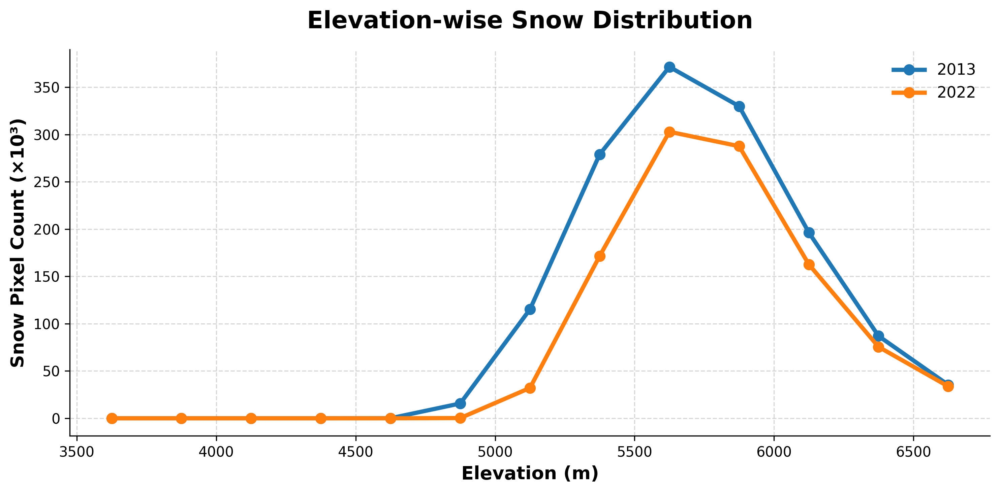

# Snow-Cover Delineation and Change Detection using Landsat 8 and DEM Integration

Python-based geospatial remote-sensing workflow for snow-cover delineation and temporal snow-change detection using Landsat 8 imagery and Digital Elevation Model (DEM) integration.

The workflow combines NDSI-based snow extraction, cloud masking, DEM-assisted classification, and morphological image processing to evaluate snow-cover dynamics between 2013 and 2022 over the Siachen Glacier region.

---

## Study Area

The study focuses on the Siachen Glacier region in the northwestern Himalaya–Karakoram terrain, characterized by high-altitude snow and glacier systems.

---

## Workflow Overview

The workflow includes:

- Surface reflectance preprocessing of Landsat 8 imagery
- DEM alignment and spatial reprojection
- Cloud and cloud-shadow masking using QA_PIXEL bands
- NDSI computation and multi-criteria snow delineation
- Morphological filtering for spatial refinement
- Snow-cover area estimation
- Temporal snow-change detection
- Elevation-wise snow-distribution analysis
- Scientific visualization and figure generation

---

## Datasets Used

### Landsat 8 Level-2 Surface Reflectance Data
- Green Band (Band 3)
- SWIR Band (Band 6)
- QA_PIXEL Band

### Digital Elevation Model (DEM)
- SRTM 30 m DEM

---

## Technologies and Libraries

- Python
- NumPy
- Rasterio
- SciPy
- Matplotlib

---

## Generated Outputs

- NDSI maps
- Binary snow-cover maps
- Temporal snow-change map
- Elevation-wise snow-distribution plots
- Snow-cover statistics and change estimates

---

## Key Findings

- Snow-covered area decreased from ~1310 km² in 2013 to ~984 km² in 2022.
- Total observed snow-cover reduction was ~326 km².
- Overall snow-cover declined by ~24.9% during the study period.
- Maximum snow concentration was observed within higher elevation zones (~5500–6000 m).

---

## Outputs

### Snow-Cover Analysis


### Elevation-wise Snow Distribution


---

## Repository Structure

```text
Snow-Cover-Change-Detection/
│
├── snow_cover_change_detection.ipynb
├── README.md
│
├── outputs/
│   └── figures/
│       ├── snow_analysis.png
│       └── elevation_distribution.png